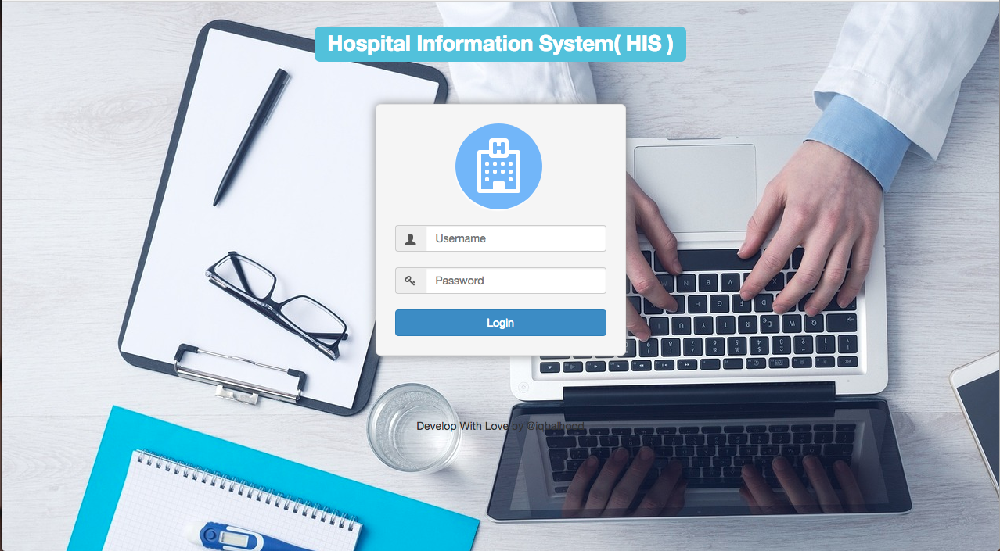

# SampleHIS
Sample of Hospital Information System 

http://hospital.codedojo.asia

  

# Application Features
### Front Officer

1. CRUD patient data
1. CRUD patient data outpatient
1. CRUD data of inpatients
1. Rates of inpatient, outpatient based on service

### Department

1. Displays outpatient data based on departments
1. Outpatient data search by department
1. Choosing a medical examiner
1. Displays the check status
1. Displays doctors data

### Doctor

1. Displays patient data
1. search patient data
1. filling patient diagnostic data
1. CRUD recipes
1. Print recipes

#### Made with &#9829;
Follow me on instagram :)
- [@iqbalhood](https://instagram.com/iqbalhood)

### Contribution Process

1. Submit an issue describing your proposed change to the repo in question.
1. The repo owner will respond to your issue promptly.
1. Fork the desired repo, develop and test your code changes.
1. Ensure that your code adheres to the existing style of the library to which
   you are contributing.
1. Ensure that your code has an appropriate set of unit tests which all pass.
1. Submit a pull request and cc @iqbal09
